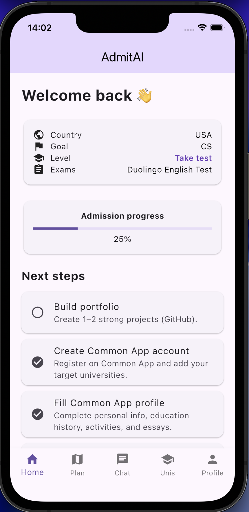
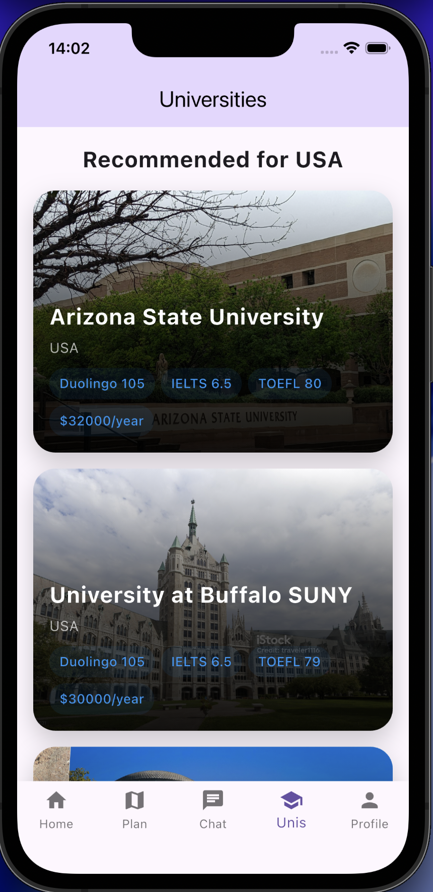
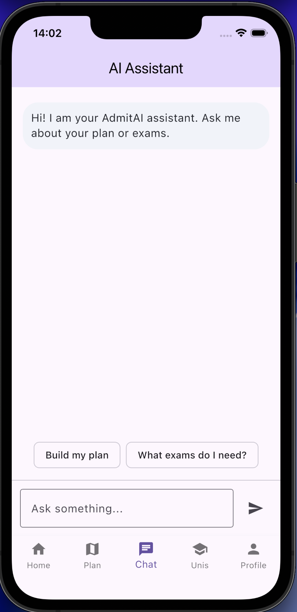
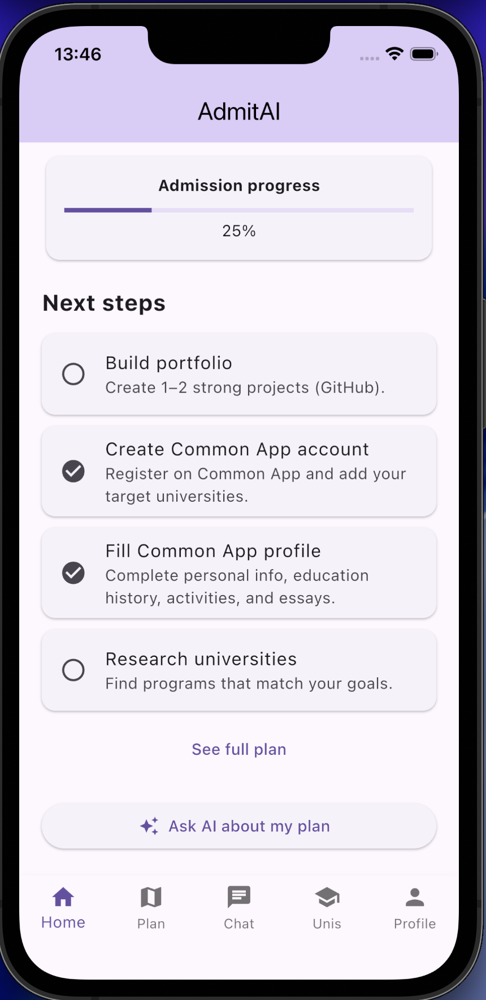
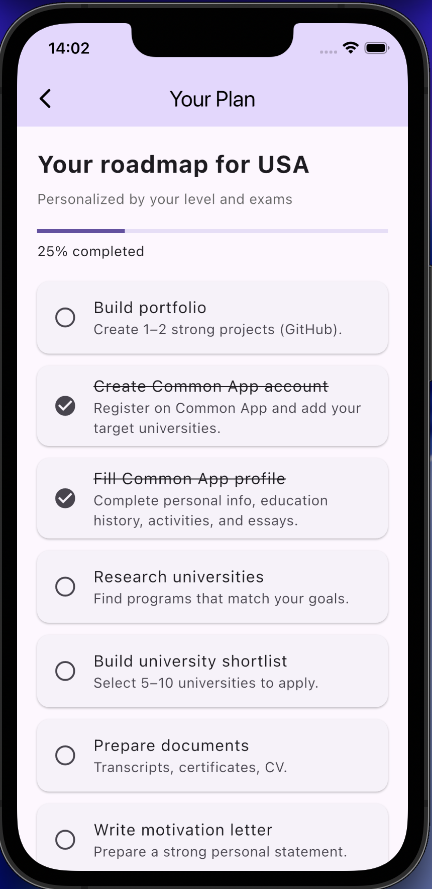
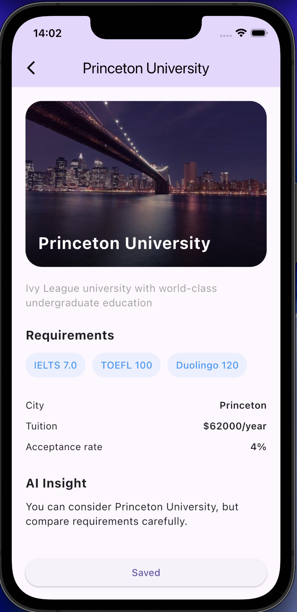
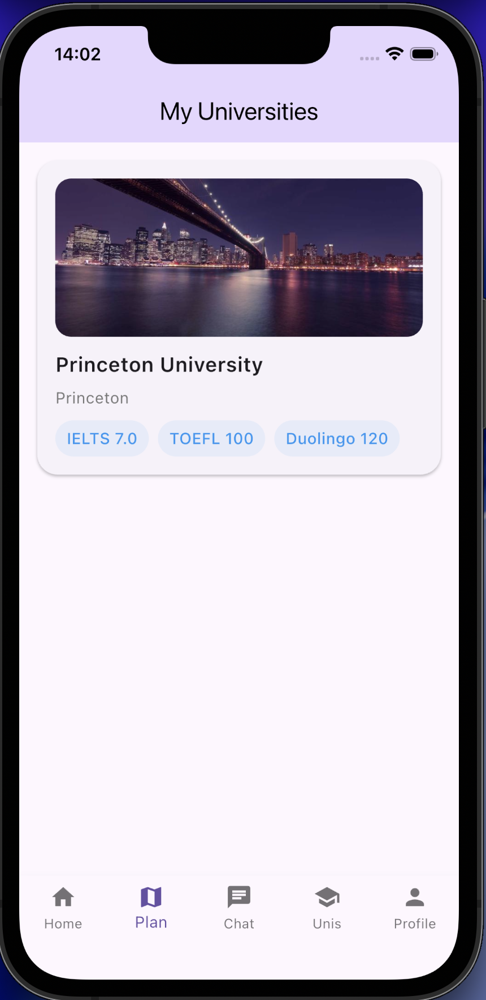
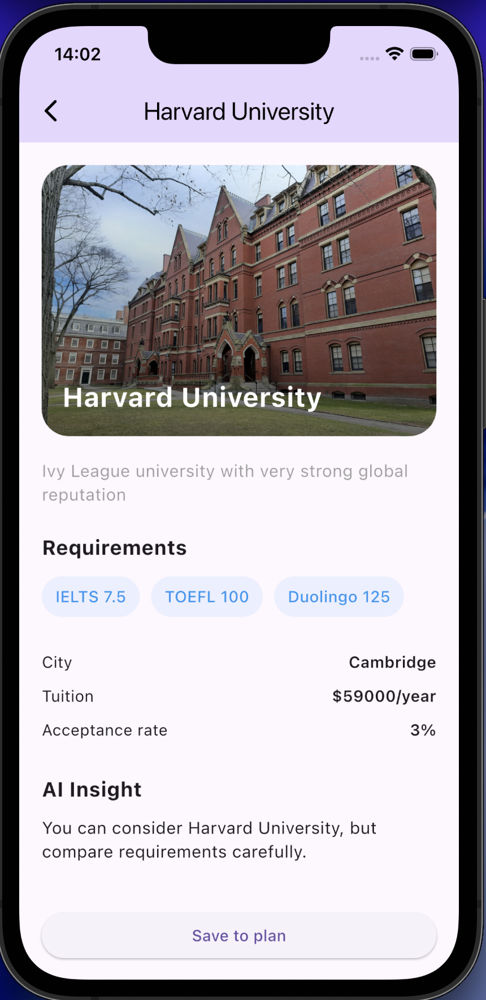
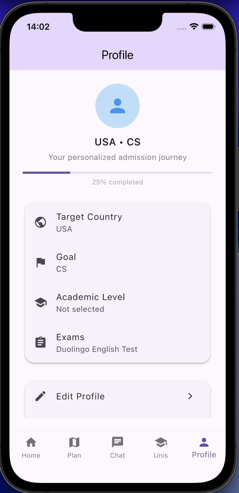
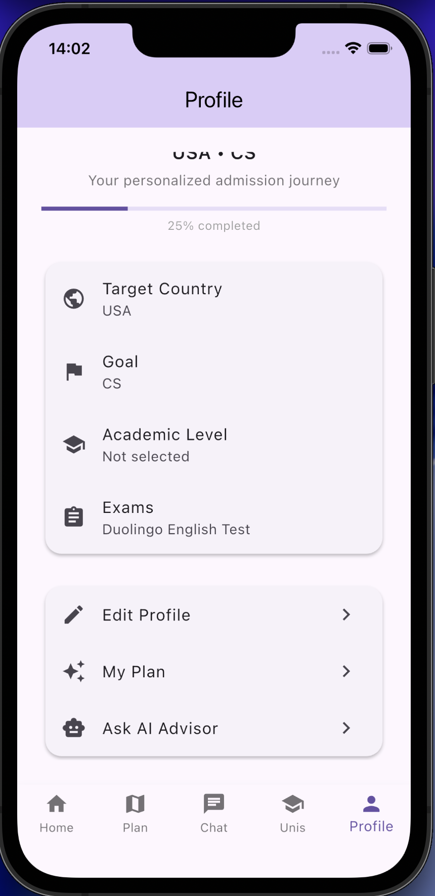

# AdmitAI — AI-Powered University Admission Assistant

AI-powered admission assistant that helps students explore universities, track admission progress, and receive personalized guidance.

Helps international students navigate university admissions, requirements, and decision-making with structured guidance and AI assistance.

## Problem
International students often struggle with understanding university requirements, exams, and admission processes.

## Solution
AdmitAI simplifies the admission journey by providing a structured platform for university discovery, progress tracking, and AI-based assistance.

## Features
- University search with filters (country, exams)
- Admission progress tracking
- AI-powered assistant chat
- Personalized recommendations
- Clean mobile UI

## Tech Stack
- Flutter (Dart)
- Firebase (Firestore, Auth)
- GitHub

## Screenshots

  
  
  

### Home

### Roadmap / Progress

### Universities

### University Details

### AI Assistant

### Profile

## Demo
[Watch Demo](https://youtube.com/shorts/fpsyzEJ_XSc?feature=share)

## My Role
I independently designed and developed the full mobile application, including UI/UX, Firebase backend integration, admission logic, and AI-related features.

## Project Goal
This project reflects my interest in building technology that simplifies complex real-world processes and helps people make informed decisions about their future.
